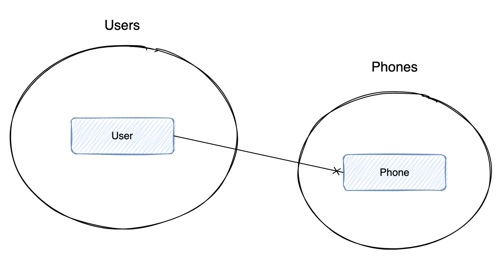
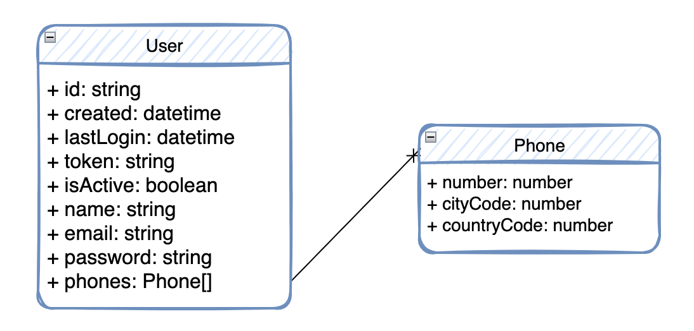
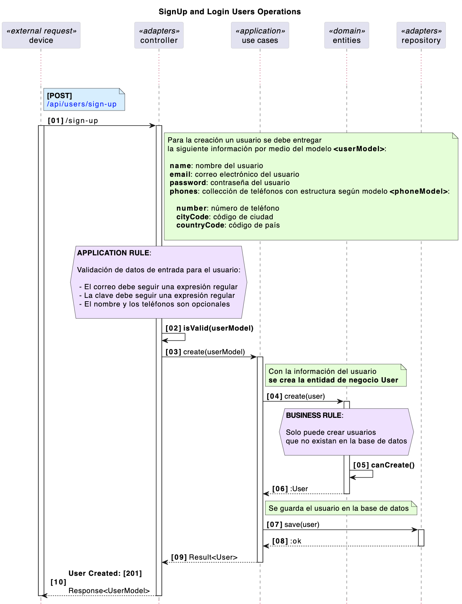
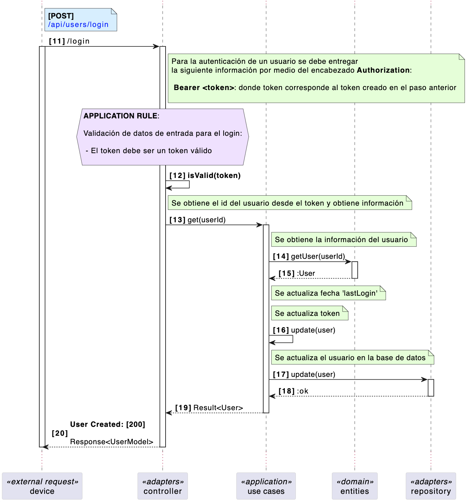
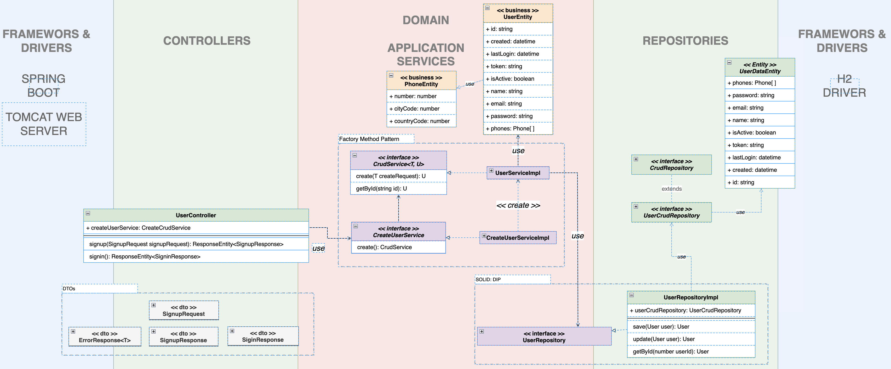
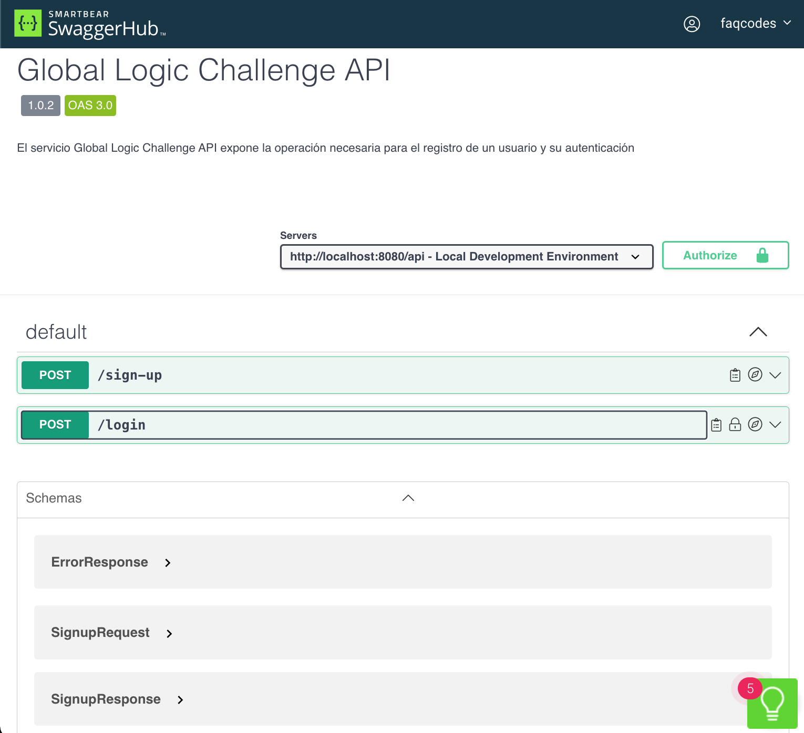

# Desafío Global Logic

A continuación se presenta la solución (diseño e implementación) del desafío Global Logic correspondiente al desarrollo de un microservicio. El enunciado del desafío se encuentra en este enlace [ENUNCIADO](docs/ejercicio-java.pdf)

## Diseño

Se trata de dar solución al problema con un enfoque de **"design-first"**. El problema comprende el registro y login de un usuario por medio de una API Rest (microservicio). Para el diseño de la solución se comienza definiendo las entidades del negocio (dominio), encontrándose 2: User y Phone:

Se establecen algunos atributos iniciales que pueden tener las entidad de negocio **User** y **Phone**; como se muestra en la siguiente imagen:

Según el enunciado se deben realizar 2 operaciones sobre la entidad **User** y se deben exponer como API REST. Aquí se puede ver que para la entidad **Phone** no existen casos de uso, sino complementará la información de **User**. También se deben realizar algunas validaciones en los datos de entrada, persistir los datos y realizar pruebas.

Con lo anterior se puede realizar un diagrama de secuencia que permita visualizar el flujo de estas operaciones dentro del sistema para su mejor entendimiento. A continuación, se muestra un diagrama de secuencia con las operaciones **sign-up** y **login** requeridas en el enunciado:

## Diseño detallado

Con la información obtenida hasta el momento, es posible realizar un diseño detallado de la solución. A continuación, se presenta el diagrama con los detalles de los componentes y sus interacciones:

Con respecto a las entradas y salidas del sistema se busca alcanzar el máximo nivel de madurez para la API, es decir, utilizar los métodos y verbos HTTP para las distintas operaciones e incluir el principio **HATEOS**. También, se busca una salida consistente para ser tratada por el cliente de manera simple, obtienendose una estructura para errores como se detalla en el enunciado.

## OPEN API (Swagger)

Ya con el diseño detallado es posible documentar la API. En el siguiente enlace [Global Logic Challenge API](https://app.swaggerhub.com/apis-docs/FAQ_CODES/globallogic-chellenge-api/1.0.2) se encuentra la documentación.

Este es un intento previo para probar el funcionamiento y visualización de los objetos que la API retorna, sin encontrarse aún implementada. Dado lo anterior es posible que, luego de la implementación, existan algunos cambios mínimo pero que serán documentados.

## Implementación

## Modo de uso
